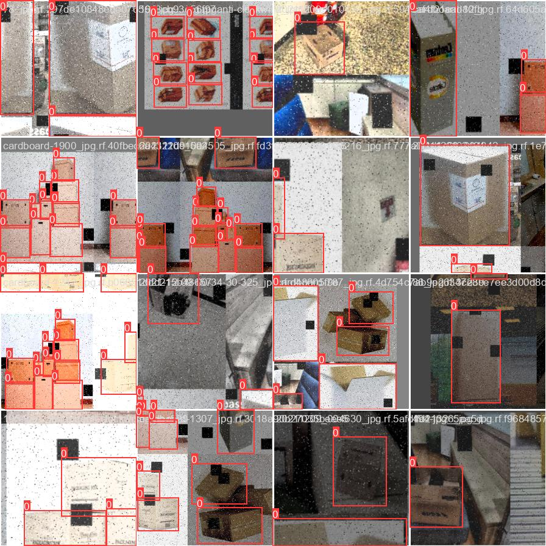

# Smart Track Ware:Inventory Management System

## Problem Statement
Efficient inventory management is critical for ensuring smooth warehouse operations and prompt order fulfillment. Traditional manual inventory procedures are often inefficient, error-prone, and labor-intensive, leading to delays, mistakes, and higher operational costs. These challenges necessitate a modern solution that can streamline processes, reduce errors, and enhance overall efficiency.

## Project Scope and Objectives
This project aims to develop a comprehensive inventory management system leveraging computer vision to revolutionize warehouse operations. By processing videos and images of cardboard boxes in the warehouse, the system can perform tasks such as object detection, tracking, and item counting.

The primary objective is to enhance efficiency by automating inventory management tasks, speeding up processes, and reducing reliance on manual labor. By minimizing human error in inventory counting and tracking, the system allows staff to focus on more strategic tasks and increase productivity.

## Solution Outline
In this project, we use the YOLOv8 object detection model for detecting boxes in the warehouse using computer vision. YOLOv8 is a popular deep learning-based object detection algorithm known for its real-time processing capabilities. The rationale behind selecting YOLOv8 lies in its ability to detect and localize objects accurately and efficiently in images.

To tailor YOLOv8 for our specific needs, we fine-tuned the model on a labeled dataset consisting of cardboard box images since YOLOv8 does not come pre-trained to recognize cardboard boxes specifically. This custom training enables YOLOv8 to leverage its robust detection capabilities for effective box detection.

By integrating YOLOv8 into the SmartTrack project, we aim to achieve highly effective box detection and management of inventory in warehouses. This integration will significantly improve efficiency and accuracy, reducing the reliance on manual labor. The ultimate goal is to transform traditional inventory management practices, enhancing operational productivity and customer satisfaction.

## Our Model
We used YOLOv8 in its various configurations—YOLOv8n, YOLOv8m, YOLOv8l, and YOLOv8x—on different datasets to achieve the best results. In our initial dataset, which contained low-quality images, we got 85% accuracy for all models in object detection, and the model detected all square objects as a box. This impacted the models' performance. Ultimately, we found a high-quality dataset that greatly enhanced the models' accuracy, allowing YOLOv8x to identify objects with 95% accuracy. In the end, we chose YOLOv8x because it's larger and more complex, and typically offers higher accuracy.

For more details about model architecture: [YOLOv8 on Ultralytics GitHub](https://github.com/ultralytics/ultralytics?tab=readme-ov-file)



## Dataset We use

We selected a dataset from  [Roboflow](https://universe.roboflow.com/carboard-box/carboard-box/dataset/2) that includes images already labeled of cardboard boxes for object detection specifically for boxes. This dataset is essential for training and validating our computer vision system, which aims to detect, track, and count items. The dataset contains more than 9,000 images, providing a robust foundation for developing an accurate and reliable model.

The images in the dataset feature cardboard boxes in various settings, orientations, and lighting conditions, simulating real-world warehouse environments. Each image is marked with bounding boxes that show where the cardboard boxes are located, ensuring that the model learns to recognize and localize these items effectively.

## Training and Validation
For object detection, we trained our data with YOLOv8, using 50 epochs, a batch size of 524, and an image size of 242, achieving an accuracy of 95%. The below figure shows the performance of our model.


## Demo
The Streamlit app "Smart Track Ware" makes warehouse inventory management easier using AI-powered tools. It automates and optimizes inventory tracking to ensure efficiency and reduce errors. Here’s a simple explanation of what the app does:

### Image Processing
- Users can upload an image through the sidebar.
- After uploading and clicking the process button, the app uses its model to analyze the image.
- It highlights detected boxes and shows the total number of boxes.
- The processed image is displayed on the main page.

### Video Processing
- Users can upload a video for processing.
- The app uses its model for box detection and tracking.
- The video is analyzed frame by frame, detecting and tracking boxes, and creating an output video with annotations and box IDs.
- It shows the total number of detected boxes and allows users to view the processed video within the app.

[Click here to download the our demo](https://github.com/raydbasa/Smart-Trackware/blob/f56c43a4bca16cb4dabf046ea4f826032c4beb75/demo_Video.mp4)

### To Run Our Colab Notebook

1. First, open the `Smart_TrackWare.ipynb` file.
2. Then, click on "Open in Colab."

#### Requirements

To install the required dependencies, use the `requirements.txt` file:

1. Install dependencies:
    ```sh
    pip install -r requirements.txt
    ```

### To run our demo:
1. Clone the repository:
    ```sh
    git clone https://github.com/raydbasa/Smart-Trackware.git
    ```
2. Create and activate a new environment:
    ```sh
    conda create --name myenv
    conda activate myenv
    ```
3. Install the required dependencies:
    ```sh
    conda install -c conda-forge streamlit opencv numpy tqdm
    pip install deep-sort-realtime ultralytics
    ```
4. Download the best model from Google Drive:
    [Download Model](https://drive.google.com/file/d/1149lReYp0oRzCkeXYup-ERXzX6O1huRA/view?usp=drive_link)
    ```sh
    wget --no-check-certificate 'https://docs.google.com/uc?export=download&id=1149lReYp0oRzCkeXYup-ERXzX6O1huRA' -O best_model.pth
    ```
5. Run the Streamlit app:
    ```sh
    streamlit run app.py
    ```


    
## Future Work
Future work will focus on enhancing the system's capabilities by classifying the products and providing real-time by connecting all live cameras in the warehouse to accurately count the incoming boxes. The data from the live cameras will be converted into Excel reports to simplify inventory management.


## Tools We Use
### Libraries
- **ByteTrack**: Utilized for tracking detected objects over time.
- **OpenCV**: Used for image and video processing tasks.
- **Torch**: The deep learning library used to build and train the YOLOv8 model.

### Build Model
- **Colab Pro**: Employed for model training and experimentation.
- **Ultralytics**: Provides the YOLOv8 framework and tools for implementation.


### Demo
- **Visual Studio Code**: The development environment for coding and testing.
- **Streamlit**: Used to create a user-friendly interface for demonstrating the model's capabilities.

## Presentation

[View Canva Presentation](https://www.canva.com/design/DAGF2JPUUcE/acaPcy8cbbwOd87PQbzLvg/edit)


